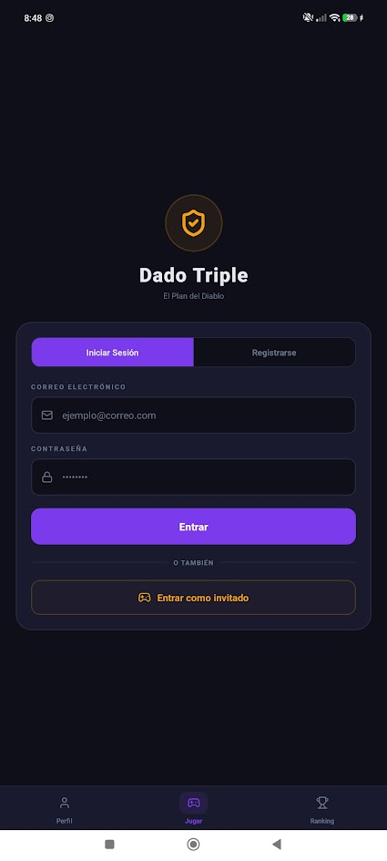
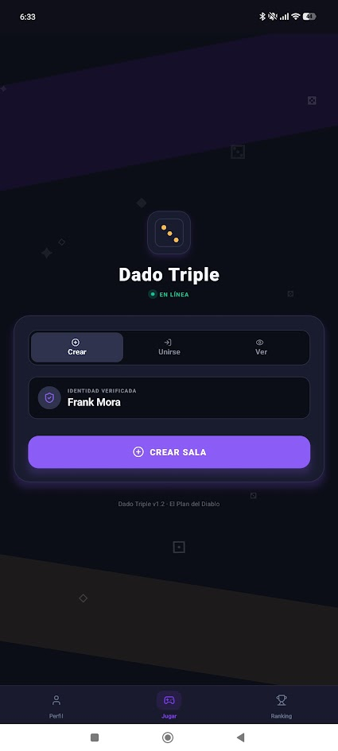
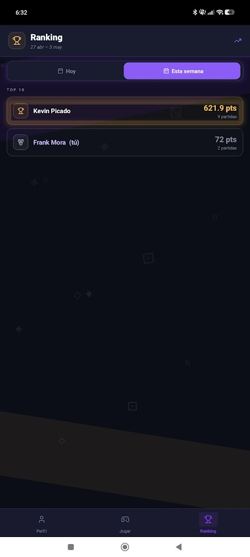
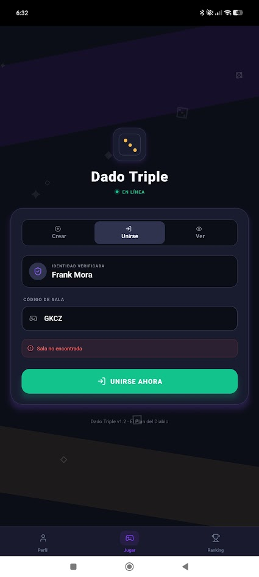
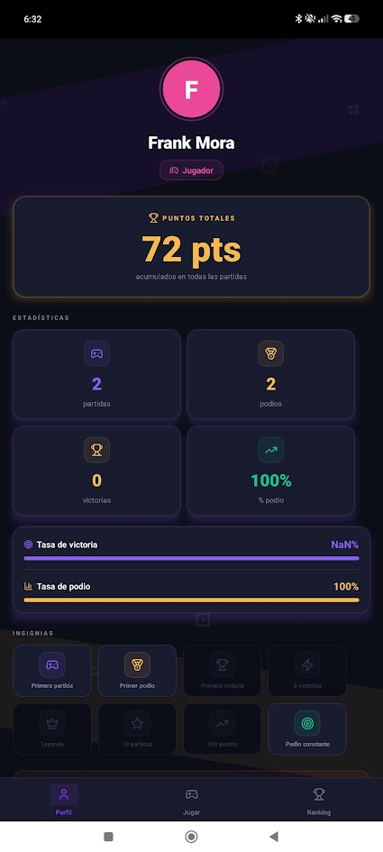

# 🎲 Dado Triple — Juego de Dados Multijugador en Tiempo Real

Juego de dados multijugador para Android desarrollado en React Native (CLI) con un backend Node.js que gestiona las salas, rondas y puntuaciones a través de WebSockets nativos.

---

## 🏗️ Arquitectura General

```
DaDosMagicos/
├── backend/          # Servidor Node.js (API REST + WebSocket)
└── DadoTriple/       # App móvil React Native (Android)
```


## ⚙️ Requisitos Previos

- **Node.js** v18 o superior
- **npm** v9 o superior
- **Android Studio** con un emulador configurado (o dispositivo físico con USB debugging)
- **Java JDK 17**
- Cuenta en **MongoDB Atlas** (o instancia local)


## 🚀 Configuración y Ejecución

### 1. Backend (Node.js + WebSocket)

```bash
cd backend
npm install
```

Crea el archivo `backend/.env` con las siguientes variables:

```env
PORT=3000
WS_PORT=3000
MONGO_URI=mongodb+srv://<usuario>:<password>@dadosmagicos.s78oqlm.mongodb.net/?appName=DaDosMagicos
JWT_SECRET=tu_secreto_super_seguro
NODE_ENV=development
```

Iniciar el servidor:

```bash
# Desarrollo (con recarga automática)
npm run dev

# Producción
npm start
```

El servidor expone:
- **REST API** en `http://localhost:3000`
- **WebSocket** en `ws://localhost:3000`


### 2. App Móvil (React Native CLI — Android)

```bash
cd DadoTriple
npm install
```

Configura la URL del servidor en `src/config.js`:

```js
export const CONFIG = {
  API_URL: 'http://<IP_DE_TU_PC>:3000',
  WS_URL:  'ws://<IP_DE_TU_PC>:3000',
};
```

Ejecutar en Android:

```bash
npx react-native run-android
```

## 📁 Estructura del Proyecto

### Backend (`backend/src/`)

| Archivo / Carpeta | Descripción |
|---|---|
| `index.js` | Punto de entrada: HTTP + WebSocket server |
| `config/` | Variables de entorno y configuración global |
| `websocket/handler.js` | Lógica principal de eventos WebSocket (join, roll, select, etc.) |
| `game/` | Motor del juego: reglas, cálculo de puntos, fases de ronda |
| `rooms/` | Gestión del estado de las salas en memoria |
| `models/` | Esquemas Mongoose (Player, Match) |
| `repositories/` | Capa de acceso a datos (MongoDB) |
| `controllers/` | Controladores REST (auth, ranking, perfil) |
| `routes/` | Rutas Express (API REST) |
| `services/` | Servicios de negocio (auth, estadísticas) |
| `db/` | Conexión a MongoDB |

### App Móvil (`DadoTriple/src/`)

| Archivo / Carpeta | Descripción |
|---|---|
| `App.tsx` | Navegación principal (Stack Navigator + Tab Bar) |
| `config.js` | URLs de API y WebSocket |
| `screens/AuthScreen.js` | Pantalla de login / registro |
| `screens/LobbyScreen.js` | Crear sala, unirse o entrar como espectador |
| `screens/WaitingRoomScreen.js` | Sala de espera antes de iniciar la partida |
| `screens/GameScreen.js` | Pantalla principal del juego (tablero, dados, predicciones) |
| `screens/RoundResultsScreen.js` | Resultados al final de cada ronda |
| `screens/GameOverScreen.js` | Pantalla final con clasificación |
| `screens/SpectatorScreen.js` | Vista de espectador en tiempo real |
| `screens/RankingScreen.js` | Ranking global de jugadores |
| `screens/ProfileScreen.js` | Perfil del jugador y estadísticas |
| `services/socketService.js` | Cliente WebSocket con reconexión automática (3 min) |
| `services/soundService.js` | Reproducción de efectos de sonido |
| `services/apiService.js` | Cliente REST para auth y estadísticas |
| `store/useGameStore.js` | Estado global del juego con Zustand |
| `hooks/useWebSocket.js` | Hook que conecta eventos WebSocket al store |
| `components/` | Componentes reutilizables (DiceFace, GameButton, MagicBackground, etc.) |
| `theme/` | Sistema de diseño: colores, sombras, radios, espaciado |

---

## 🎮 Flujo del Juego

1. **Auth** — El jugador inicia sesión o se registra
2. **Lobby** — Crea una sala, se une con código o entra como espectador
3. **Waiting Room** — Espera a que el host inicie la partida
4. **Game** — 3 lanzamientos × 3 rondas = 9 turnos por lanzamiento
   - Fase `rolling` → El jugador activo tira los dados
   - Fase `predicting` → Cada jugador predice su puntuación (alto / medio / bajo / cero)
   - Fase `selecting` → Por turnos, cada jugador elige 3 dados para presentar
   - Fase `scoring` → El servidor calcula puntos y bonificaciones
5. **Round Results** — Se muestran los resultados de la ronda
6. **Game Over** — Clasificación final

---

## 🛠️ Tecnologías

| Capa | Tecnología |
|---|---|
| App móvil | React Native CLI (Android) |
| Estado global | Zustand |
| Navegación | React Navigation (Stack) |
| Comunicación tiempo real | WebSocket nativo (`ws` en servidor, `WebSocket` en cliente) |
| Backend | Node.js + Express |
| Base de datos | MongoDB + Mongoose |
| Autenticación | JWT + bcrypt |
| Iconos | lucide-react-native |
| Animaciones | React Native Animated API |

---

## 👥 Equipo

- **Frank Mora Sanchez** — Desarrollo frontend, arquitectura de estado y flujo de navegación y despliegue del proyecto.
- **Kevin Picado** — Lógica del juego, motor de predicciones y refinado del proyecto general,generacion del apk movil.
- **Michael Carranza** — Base de Datos e Integraciones Desarrollo de pantallas de juego soporte.
- **Kevin Nuñez** — Sonido,Animaciones y Diseño refinado de interfaces de usuario.


## 📝 Notas de Desarrollo

- El servidor mantiene el estado de las salas **en memoria** (no en base de datos) para minimizar latencia.
- El cliente WebSocket implementa **reconexión automática** de hasta 3 minutos ante caídas de red.
- El sistema de predicciones usa un **Bottom Sheet animado** que se puede colapsar para ver los dados mientras se decide.
- Los dados ocultos (azul y rojo) son visibles solo para el jugador dueño; los demás ven un escudo.

---

## 📸 Capturas de Pantalla





